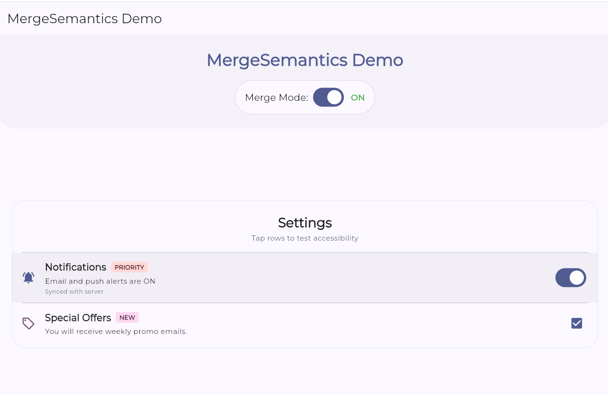

# MergeSemantics Demo

A simple Flutter demo showcasing the `MergeSemantics` widget, which combines the semantics of its descendants into a single semantic node for better accessibility.

## Widget Description
`MergeSemantics` is a widget that merges the semantic information of its descendants into one single node, useful for grouping related information (like a list item) so screen readers announce it as a single cohesive unit.

## How to Run
1.  Ensure you have Flutter installed and set up.
2.  Clone this repository.
3.  Open a terminal in the project directory.
4.  Run the following commands:
    ```bash
    flutter pub get
    flutter run
    ```
5.  To test the accessibility features, turn on your device's screen reader (TailkBack on Android, VoiceOver on iOS).

## attributes Demonstrated

1.  **`child`**:
    *   This is the primary property of `MergeSemantics`. It takes a widget tree (like a `Row` or `Column`) whose semantic information needs to be merged. In the demo, we pass a `Container` with multiple texts and buttons as the child.

2.  **`Semantics.label` (in child)**:
    *   This attribute belongs to the children within the merged tree. When merged, all `label` properties from the descendants (e.g., "Bohemian Rhapsody", "Queen") are concatenated into a single announcement string.

3.  **`Semantics.button` / `onTap` (in child)**:
    *   If a descendant has an interactive semantic property (like `button: true` or an `onTap` handler), `MergeSemantics` can promote this interaction to the merged node, making the entire area tappable and announced as a "button" by the screen reader.

## Screenshot


*(Please add a screenshot of your running app here and name it screenshot.png)*
